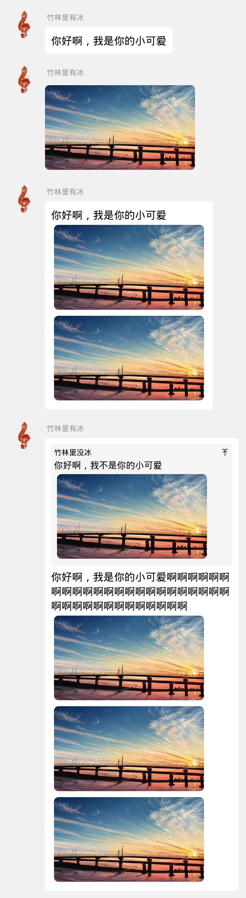

# qq-quote-generater

一个基于 headless firefox 实现的低性能 qq 聊天语录图片生成 api，灵感来源于 telegram 的 [quote-bot](https://github.com/LyoSU/quote-bot)。

## 使用方法

使用 POST 请求 /，消息体中需要携带 json 数据，具体的数据样例可以参考 [data_example.json](./data_example.json)

其中 user_id 和 user_nickname 为必填字段，message 与 image 需选择一个以上；如果 json 数据中含有 reply，则 reply 中的 user_nickname 为必填字段，reply 中的 message 与 image 需选择一个以上。

以下是由 data_example.json 生成的图片预览

